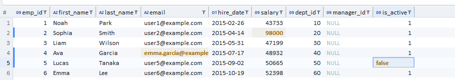
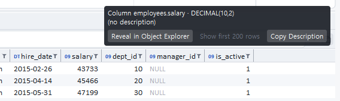
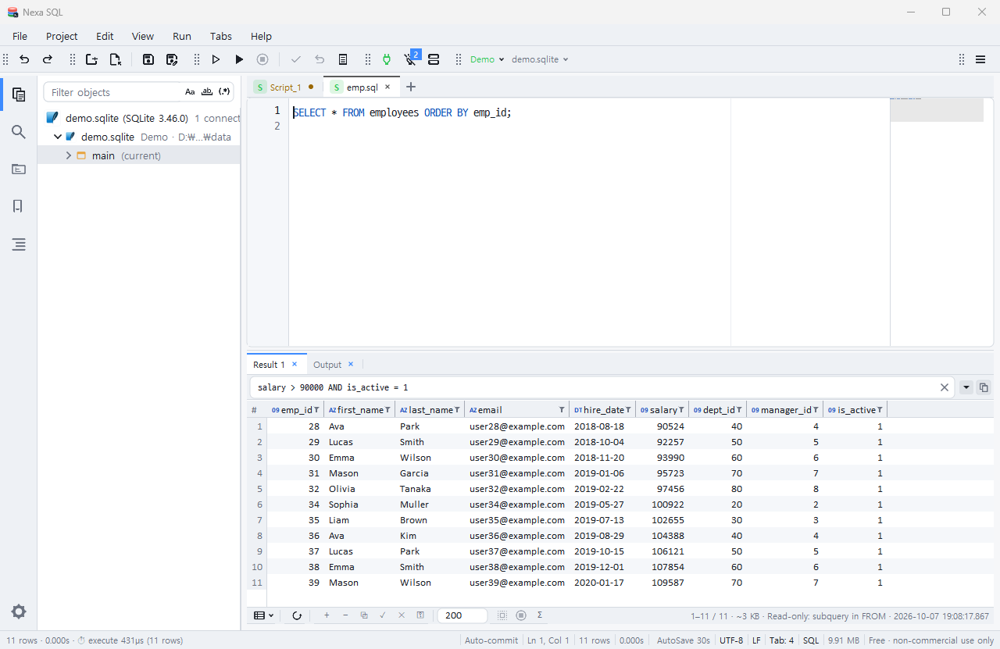
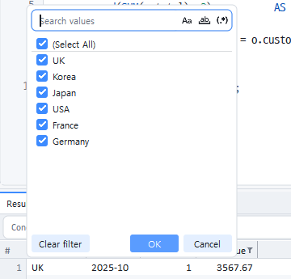
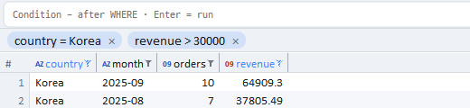

# 결과 그리드에서 데이터 편집

단일 테이블을 조회한 결과는 그리드에서 바로 고칠 수 있습니다. 고친 내용은 **적용(✓)** 을 누를 때까지 서버에 가지 않고, 적용은 **한 트랜잭션**으로 묶여 하나라도 실패하면 전부 되돌아갑니다.

## 언제 편집할 수 있나

| 결과 | 편집 |
|---|---|
| `SELECT a, b FROM t` · `SELECT * FROM t WHERE …` · `SELECT t.a FROM t t` | 가능 |
| JOIN · GROUP BY · DISTINCT · UNION · 서브쿼리 FROM · 식/별칭 열(`a+1`, `a AS x`) | 읽기 전용(상태줄에 이유) |
| 뷰 · 프로시저 결과 · 커서 · 운영(PROD) 접속 · 설정 `grid.edit` 끔 | 읽기 전용 |

행을 서버에서 **정확히 하나** 찾을 수 있어야 합니다. Nexa SQL은 다음 순서로 방법을 정합니다.

| 등급 | 조건 | 무엇으로 찾나 |
|---|---|---|
| 1급 | PK 또는 UNIQUE 열이 결과에 전부 있다 | 그 키 열(원본 값) |
| 1급-보완 | 키는 있는데 결과에서 빠졌다(`SELECT name FROM emp`) | 키 열을 **숨은 열**로 덧붙여 한 번 다시 조회(화면에는 안 보임 · `grid.edit_hidden_keys`) |
| 2급 | 키가 없다 | DBMS 행 식별자를 숨은 열로 덧붙여 한 번 다시 조회 — Oracle `ROWID` · SQLite `rowid` · PostgreSQL `ctid`+`xmin`(`grid.edit_rowid`) · SQL Server/MySQL은 없음 |
| 3급 | 키도 행 식별자도 없다 | 비교 가능한 **모든 열**의 원본 값(LOB·실수·긴 문자·xml/json·공간형 제외 · `grid.edit_all_cols`) |
| 읽기 전용 | 위 어느 것도 안 된다 | — |

숨은 열은 복사·텍스트 보기·⌘A/Ctrl+A 어디에도 나오지 않고 WHERE 절에만 쓰입니다. 다시 조회에 실패하면(예: SQLite `WITHOUT ROWID` 표) 원래 문장으로 돌아가 3급으로 판정합니다.

*그리드에서 고친 셀(강조) · 고친 행 왼쪽 띠 · 열 머리 타입 배지(AZ 문자 · 09 숫자 · DT 날짜)*

## 편집 방법

| 동작 | 키·마우스 |
|---|---|
| 편집 시작 | Enter · **F2** · 더블클릭 · 그냥 타이핑(첫 글자로 시작) |
| 확정 | Enter(아래 셀로) · Tab / Shift+Tab(오른쪽/왼쪽 셀로) · 다른 셀 클릭 |
| 취소 | Esc |
| 셀 비우기 / NULL | Delete · Backspace(빈 값 = NULL은 `grid.edit_empty`) · 우클릭 ▸ Set NULL |
| 셀 이동(편집기 밖) | 화살표 · Tab / Shift+Tab |
| 행 추가 · 복제 · 삭제 | 툴바 `+ ⧉ −` · 우클릭 메뉴(삭제는 표시만 · 적용 때 DELETE) — 복제·삭제는 **셀을 하나 고른 뒤** 켜집니다(행 추가는 언제나) |
| 행 복제(키) | **Ctrl+D**(맥 ⌘D) |
| 붙여넣기 | ⌘V/Ctrl+V — 탭·줄 구분 행렬을 선택 셀부터 채움(행이 모자라면 자동 추가 · 상한 `grid.paste_max_rows`) |
| 되돌리기 / 다시 하기 | ⌘Z/Ctrl+Z · ⌘⇧Z/Ctrl+Y(그리드 편집 전용 이력) |
| 변경 목록 · SQL 미리보기 | 우클릭 ▸ Changes / Preview SQL(보낼 문장을 리터럴로) |
| 적용 · 전부 되돌리기 | 툴바 ✓ / ✕ |

> **F2와 Ctrl+D(⌘D)는 결과 그리드에 포커스가 있을 때만** 위 동작을 합니다. 편집기 등 그리드 밖에서는 원래대로 F2 = 다음 북마크 · Ctrl+D = 다음 같은 낱말 선택입니다. Ctrl+F2 · Shift+F2처럼 다른 키가 함께 눌리면 그리드에서도 원래 동작입니다.

편집 중인 셀은 표시 글자와 같은 자리에 상자가 열리고 긴 글은 첫머리부터 보입니다. 상자 안에서 더블클릭은 단어, 세 번 클릭은 전체 선택입니다(`editor.dblclick` · `editor.triple_click` · `editor.dblclick_underscore`).

## 표시

*열 머리에 잠시 머물면 카드가 뜹니다 — 출처 테이블 · 컬럼 · 타입 · 설명 · 탐색기에서 보기 / 설명 복사(단일 테이블 결과)

- **바뀐 셀** = 글자색 주황 + 굵게(배경은 살짝만). 값을 고쳤다가 원래 값으로 되돌리면 바뀐 것으로 치지 않습니다(A → B → A = 변경 없음).
- **행 띠**: 추가 행 초록 · 바뀐 행 강조색 · 삭제 행 빨강 + 취소선 · 적용에 실패한 행 붉은 배경.
- 푸터에 `수정 n · 추가 m · 삭제 k` — 적용 시 트랜잭션 범위입니다.

## 적용과 안전 규칙

적용(✓)은 DELETE → 키 열을 바꾸는 UPDATE → 나머지 UPDATE → INSERT 순서로 **바인드 문장**을 만들어 한 트랜잭션에 보냅니다. 데이터 보호를 위해 다음은 설정으로 끌 수 없습니다.

1. **사전 검사** — UPDATE/DELETE마다 같은 WHERE로 `SELECT COUNT(*)`를 먼저 실행해 대상 행이 정확히 1이 아니면 **아무것도 쓰지 않습니다**(완전히 같은 행이 둘 있는 3급 표 등).
2. **영향 행 수 1** — 실행한 문장이 1행이 아니면 즉시 중단.
3. **되돌림** — 자동 커밋이면 전체 롤백 · 수동 커밋이면 세이브포인트로 되돌리고 필요하면 "ROLLBACK 필요"를 알립니다.
4. **키 중복 사전 검사** — 적용 대기 변경 안에서 같은 키가 둘 이상이 되면 적용 전에 거부합니다.

실패하면 어느 문장(`UPDATE #3 (ID=5)`)이 어느 단계에서 왜 실패했는지 상태줄·로그·토스트에 그대로 적습니다.

## 적용 뒤 화면 갱신(`grid.edit_refresh`)

| 값 | 동작 |
|---|---|
| `rows`(기본) | 바뀐 행만 키로 다시 읽어 **제자리에서** 교체 · 추가 행은 그 자리에 실제 행으로 · 삭제 행 제거 · 스크롤·정렬·선택 유지. 행을 식별할 수 없으면(시퀀스 키 · PostgreSQL ctid 등) 조회 전체를 다시 실행 |
| `requery` | 늘 조회 전체 다시 실행 |
| `local` | 다시 읽지 않고 편집한 값을 그대로 둠(서버 기본값·트리거 결과는 모름) |

## 동시성(`grid.edit_concurrency`)

| 값 | WHERE에 더 비교하는 것 |
|---|---|
| `key`(기본) | 키만 |
| `key_old` | 키 + 내가 고친 열의 옛 값 |
| `all_old` | 키 + 비교 가능한 모든 열의 옛 값 |

다른 세션이 먼저 바꿨으면 사전 검사가 0행을 보고 아무것도 쓰지 않습니다.

## 큰 값(LOB) — 값 보기 창

셀을 고르고 우클릭 ▸ **View value**(또는 Enter로 편집 대신 값 창)를 열면 값을 따로 봅니다.

| 값 | 창 | 할 수 있는 것 |
|---|---|---|
| 글(CLOB · TEXT · 긴 문자열) | Text(편집 가능 셀이면 그대로 편집) | **셀에 반영**(저장은 ✓ 적용) · 파일에서 넣기 · 파일로 저장 · 복사 |
| 이진(BLOB · BYTEA · varbinary) | Hex(16진수 덤프) / Image(PNG·BMP·GIF 미리보기) | 파일에서 넣기(파일 그대로 셀에 · 라벨 `<파일 · n bytes>`) · 파일로 저장(바이트 그대로) |
| JPEG(기저) | 미리보기(회색·YCbCr · 서브샘플링 · 재시작 간격) | 프로그레시브 JPEG는 안내만 |
| 프로그레시브 JPEG/WebP | 형식은 알려 주지만 미리보기는 없음 | 파일로 저장해서 봅니다 |

상한 `grid.lob_view_max_mb`(16)를 넘는 값은 풀지 않고 16진수 앞부분만 보이며, `grid.lob_image_preview`를 끄면 이진은 늘 16진수입니다. 4,000자를 넘는 글과 이진은 CLOB/BLOB 타입으로 바인드해 저장합니다(Oracle VARCHAR2 4000 · SQL Server NVARCHAR(4000) 상한 회피).

여러 행을 파일에서 한꺼번에 넣으려면 [파일로 넣기·내보내기](Bulk-Import-Export.md)를 보세요(그리드 편집은 한 행씩 안전하게, 대량 적재는 INSERT 전용입니다).

## 관련 설정

`grid.edit` · `grid.edit_empty` · `grid.edit_refresh` · `grid.edit_hidden_keys` · `grid.edit_rowid` · `grid.edit_all_cols` · `grid.edit_concurrency` · `grid.paste_max_rows` · `grid.lob_view_max_mb` · `grid.lob_image_preview` · `tx.prod_*`(운영 접속은 편집 불가).

> 기술 문서: 저장소 `docs/87-grid-data-editing.md`(설계 · 행 식별 등급 · 데이터 보호 불변식).

## 행 식별 재조회는 기본으로 하지 않습니다 (2026-09-27)

키가 없는 표를 조회하면 예전에는 편집 준비를 위해 자동으로 한 번 더 조회(ROWID/빠진 키 열 주입)했습니다. 이제 **기본은 재조회 없음**입니다 — 결과에 PK/UNIQUE 열이 있으면 그대로 편집되고, 없으면 *모든 컬럼 값*으로 행을 맞춰 편집합니다(문장마다 정확히 1행인지 사전 검사).

더 정확한 행 식별(ROWID·키 열)이 필요하면 결과 그리드에서 **편집 툴바 ⚿ 행 식별 열 가져오기(재조회 1회)** 를 고르세요 — 그 결과에만 적용됩니다. 항상 켜려면 설정 `grid.edit_rowid` / `grid.edit_hidden_keys`를 on으로.

## 결과 필터(보기 전용 투영) (2026-10-05)

*조건 바 — WHERE 뒤 조건을 적고 Enter = 같은 탭에서 다시 조회*

*열 머리 깔때기 → 값 목록(엑셀 자동 필터처럼)*

*걸린 필터 = 칩 줄(× 로 하나씩 해제) · 깔때기 빗금*

필터는 이미 받아 온 결과에서 **보이는 행만 거르는 것**입니다 — 서버에 다시 묻지 않고 데이터도 바꾸지 않습니다.

- **걸기**: 열 머리나 셀을 우클릭해 필터 항목을 고릅니다(열 타입에 따라 문자·숫자·날짜·불리언 조건 · 정규식 · NULL 여부). 한 열에 조건 하나, 여러 열의 조건은 기본으로 모두 만족(AND)하는 행만 남습니다. 필터 메뉴의 **필터 중 하나만 맞아도(OR)** 를 체크하면 하나라도 맞는 행이 남고 칩 사이에 "OR"가 붙습니다(조회 SQL·서버 재조회도 OR로).
- **값 고르기**: 필터 ▸ **값 고르기 ▸** 에 그 열의 값이 체크 항목으로 나옵니다(받은 행에서 · NULL 제외 · 최대 30개 = 설정 `grid.filter_pick_max`). 하나 고르면 그 값만, 더 고르면 여러 값 중 하나(값 목록), 체크된 값을 다시 고르면 빠집니다.
- **깔때기 · 값 목록**(2026-10-06 · 엑셀 자동 필터와 같은 방식): 열 머리 오른쪽 끝의 흐린 **깔때기**를 누르면 그 열 아래에 값 목록이 열립니다. 맨 위 **(모두 선택)** 은 전부/일부/없음 세 상태이고, 필터가 없으면 모든 값이 체크된 채로 열립니다. 남길 값만 체크하고 **확인**을 누르면 그 값들만 보이며, 전부 체크한 채 확인하면 필터가 없어집니다. **[필터 해제]** = 이 열의 필터를 지움 · **[취소]**·Esc = 바꾸지 않고 닫기 · Enter = 확인 · 팝업 밖을 클릭하면 닫히고 그 클릭은 그대로 진행됩니다. 위 검색 상자에 글자를 넣으면(대소문자 무시 · 한글은 자모로도 · 예 `ㄱ`) 목록이 좁혀지고 맞는 값이 모두 체크되며, 목록 위에 **(모든 검색 결과 선택)** 과 **필터에 현재 선택 내용 추가** 가 나옵니다 — 추가를 끈 채 확인하면 필터가 **검색 결과로 바뀌고**, 켜고 확인하면 **이미 고른 값에 더해집니다**. 검색어를 지우면 검색 전 체크로 돌아갑니다(검색어는 저장하지 않습니다). 목록은 받은 행의 값 최대 500개(`grid.filter_values_max`) · 우클릭 메뉴 **값 목록 팝업…** 으로도 엽니다. 목록 높이는 값 수와 상관없이 12행(`grid.filter_popup_rows`)으로 고정이라 검색해도 버튼 자리가 움직이지 않습니다. 맞는 값이 없으면 "일치하는 값 없음"이 보입니다.
- **인라인 조건 입력란**(2026-10-06 · 10-07 개정 · DBeaver의 조건 바): 결과 그리드 바로 위 상자에 `WHERE` 뒤에 올 식을 쓰고 **Enter**(또는 Ctrl+Enter)를 누르면, 지금 결과를 만든 문장을 `SELECT * FROM ( … ) q WHERE 1=1 AND (식)`으로 감싸 **같은 결과 탭에서 서버에 다시 조회**합니다(받은 행만 거르는 위의 필터와 달리 전체 대상). 줄을 바꾸려면 **Shift+Enter** — 두 줄째가 되면 상자가 스스로 펼쳐집니다(최대 3줄 · `grid.cond_max_lines`). 상자 오른쪽 위 버튼: **×** = 글 전체 지우기 · **▾/▴** = 최대 줄까지 펼치기 / 한 줄로 접기(글은 그대로 · 접힌 상태에서는 캐럿 줄 하나만 보이고 키·휠로 줄을 옮깁니다) · **복사** = 감싼 SQL 복사. 글을 비우면 접힙니다. 글자를 치면 열 이름 · 함수 후보가 상자 아래에 뜹니다(Tab/Enter로 넣기). 식이 틀리면(없는 열 · 괄호 · 따옴표 · `;` 등) **실행하지 않고** 테두리가 빨갛게 되며 상태줄에 이유가 나오고, 서버가 오류를 돌려줘도 테두리가 빨갛게 되고 결과 그리드는 그대로 남습니다. **열 머리를 끌어 상자에 놓으면** 그 열 이름이 들어갑니다 — 기본은 조건 틀까지(문자 열 `열 = ''` · 숫자 열 `열 = 0` · 앞에 식이 있으면 ` AND `로 이음 · 끄기 = `grid.cond_drop_template`). 상자 안 Ctrl+C/X/V/A · Ctrl+Z/Y와 우클릭 메뉴(복사 · 잘라내기 · 붙여넣기 · 전체 선택)는 상자 글에만 작동합니다. Esc = 상자에서 나가기 · 끄기 = 설정 `grid.condition_bar`. 값 필터 칩 줄은 기본으로 숨겨져 있습니다 — 보려면 `grid.filter_strip`을 켜세요(조건 바 아래 두 번째 줄 · 필터가 있을 때만). 상자 글자는 결과 그리드와 같은 크기의 고정폭 글꼴입니다. 완성 후보는 편집기와 같은 규칙으로 뜹니다 — 두 글자부터(`intel.min_chars`) · 숫자로 시작하는 낱말(`1=1`)에는 뜨지 않음 · 처음엔 아무것도 고르지 않은 채 열리므로 ↓로 고르고, 고른 것이 없을 때 Enter는 그대로 **실행**, Tab은 그대로 통과합니다.
- **글꼴 크기**(2026-10-07): **Ctrl+=**(키우기) · **Ctrl+-**(줄이기) · **Ctrl+휠**로 바꿉니다 — 편집기에 포커스(휠은 커서)가 있으면 편집기 글꼴(`editor.font_size`), 결과 그리드면 결과 글꼴(`grid.font_size`)이 바뀌고 상태줄에 "… 글꼴 크기: N px"가 잠깐 나옵니다. 값은 설정에 저장됩니다 · 되돌리기 = 명령 팔레트 **글꼴 크기 초기화**(`view.zoom_reset`).
  - **깔때기 표시 방법**(`grid.filter_funnel`): **항상**(기본 · 모든 열에 흐리게) · **마우스가 열 머리 위에 있을 때만** · **없음**(필터가 걸린 열의 빗금 깔때기만 · 열기는 우클릭 ▸ 값 목록 팝업…). 깔때기·정렬 표식이 열 이름을 가리면 열이 그만큼 넓어집니다.
  - **필터 사용 안 함**(`grid.filter_enabled` off): 깔때기 · 필터 메뉴 · 값 목록이 모두 사라지고 걸려 있던 필터도 풀립니다.
  - **값 목록 범위**(`grid.filter_values_scope`): 기본은 **다른 열 필터를 통과한 행의 값만** 보여 줍니다(예: 부서를 먼저 거르면 이름 목록은 그 부서 사람만). 전체 값을 늘 보려면 `all`.
  - 값에 쉼표가 들어 있어도(`BOX,POWER PULSE,SMF`) 그 값 하나로 거릅니다.
  - 설정은 Preferences ▸ 데이터 편집기 ▸ **결과 필터**에 모여 있습니다.
- **필터 줄**: 필터가 걸려 있는 동안 그리드 위에 한 줄이 생기고 조건마다 **칩** 하나(`열이름 조건 ×`)가 놓입니다. 칩의 **×** = 그 열의 필터만 지움 · 줄 오른쪽 끝의 **×** = 모두 지움 · 칩이 넘치면 `+N`으로 줄입니다. 필터가 하나도 없으면 줄은 사라집니다. 끄기 = 설정 `grid.filter_strip`(기본 on).
- **몇 행이 보이는가**: 상태줄에 `n / N행`(보이는 행 / 받은 행)으로 나옵니다. 필터가 걸린 열은 머리의 깔때기 자리에 빗금 표식이 붙습니다(누르면 체크된 채로 값 목록이 다시 열림 · 머무르면 조건 툴팁).
- **같은 조건으로 서버에서 다시 조회하려면**: 우클릭 ▸ **필터 조회 SQL 복사** — 지금 조건을 WHERE로 옮긴 조회 문장을 복사합니다. 정규식처럼 DBMS 문법으로 옮기기 어려운 조건은 받은 행에서 맞는 값의 목록으로 바뀌며, 목록은 `grid.filter_list_max`개에서 멈춥니다.
- 필터는 **받은 행까지만** 봅니다. 아직 받지 않은 행(더 내려야 오는 행)은 조건에 맞아도 보이지 않습니다. 전체를 대상으로 하려면 필터 메뉴 맨 아래 **필터로 서버 재조회**를 고르세요 — 같은 조건으로 서버에서 다시 조회한 결과가 **새 결과 탭**에 열립니다(위의 조회 SQL을 복사해 직접 실행해도 같습니다).

## 참조 행 보기(외래 키 따라가기) (2026-10-05)

테이블 하나를 그대로 조회한 결과에서 **외래 키 열의 셀을 우클릭 ▸ 참조 행 보기**를 고르면, 그 값이 가리키는 부모 테이블의 행을 **새 결과 탭**으로 조회합니다(부모의 기본 키로 `SELECT *` · 복합 키도 됩니다).

- 외래 키 열이 아니거나 값이 NULL이면 항목이 흐리고, 조인 · GROUP BY 같은 결과에서는 항목이 없습니다.
- 테이블 제약은 결과가 오면 한 번 읽어 둡니다. 처음 한 번 "테이블 제약을 읽는 중"이 뜨면 잠시 뒤 다시 고르세요.
- 끄기 = 설정 `grid.fk_follow`(끄면 제약도 읽지 않습니다).
