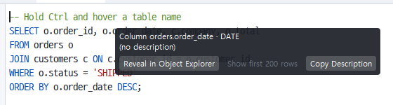

# Ctrl 객체 링크와 설명 툴팁

SQL 편집기에서 **Ctrl(macOS는 ⌘)을 누르고 있는 동안** 문장 속 테이블·뷰·컬럼·프로시저/함수 이름이 **링크**가 됩니다. 마우스를 올리면 그 이름에 밑줄이 생기고 객체의 **설명(코멘트)** 이 툴팁으로 뜨며, 클릭하면 설명을 복사할 수 있습니다.

## 3분 사용법

*Ctrl 링크 카드 — 컬럼 · 타입 · 설명 · 탐색기에서 보기 / 설명 복사 버튼*

1. 접속한 상태에서 SQL 탭에 커서를 두고 **Ctrl**을 누른 채로 마우스를 이름 위에 올립니다. 기본은 **마우스 아래 링크 하나만** 1 px 밑줄(설정 `objlink.display`에서 "Ctrl 동안 전부"로 바꿀 수 있음).
2. **우상단**에 `테이블 TB_ORDER` + 설명이 뜹니다(스키마 접두는 `objlink.show_schema`로 · 기본 끔). 설명이 없으면 "(설명 없음)". 이름이 **현재 연결의 메타에 없으면**(다른 DB의 테이블 · 오타) 밑줄이 **밝은 벽돌색 물결**로 바뀌고 툴팁은 "(현재 연결에 없는 객체)"입니다 — 구조상 객체 자리이지만 설명을 가져올 곳이 없다는 뜻입니다.
3. **좌클릭** = 설명을 클립보드로(상태줄에 "… 설명 복사됨"). **Shift+좌클릭** = `이름 - 설명` 형태로(테이블 `TB_ORDER - 주문` · 컬럼 `TB_ORDER.ORD_NO - 주문 번호` · 스키마 접두는 `objlink.show_schema`). **우클릭** = 메뉴 "설명 복사" · "이름 - 설명 복사" · **"객체 탐색기에서 보기"**(실제 객체로 확인된 링크에서만 켜짐 — 왼쪽 객체 탐색기를 그 객체까지 펼쳐 선택합니다. 테이블·뷰·프로시저·함수·패키지는 물론 `패키지.프로시저`는 패키지 아래 Procedures/Functions의 그 멤버를, 컬럼은 테이블 아래 Columns의 그 컬럼을 고릅니다. 폴더를 아직 읽지 않았으면 읽는 동안 잠깐 기다렸다가 선택됩니다).
4. Ctrl을 떼면 밑줄과 툴팁이 사라지고 편집기는 평소처럼 동작합니다.

> **키보드로**: 객체 이름에 캐럿을 두고 **F4**(또는 팔레트 ▸ "객체 탐색기에서 보기")를 누르면 왼쪽 객체 탐색기에서 그 객체가 선택됩니다 — 컬럼이면 소속 테이블 아래의 그 컬럼. Ctrl을 누르거나 마우스를 쓸 필요가 없습니다(2026-10-05).
> **객체 정보를 탭으로**: 탐색기에서 객체를 고른 뒤 **Shift+F4**(팔레트 ▸ "객체 정보를 탭으로 열기")를 누르면 아래 객체 상세 패널의 내용이 읽기 전용 탭 `ℹ 스키마.이름`으로 열립니다(복사·검색·비교용 · 저장할 필요 없음). 팔레트 ▸ **데이터 200행 보기**는 고른 테이블·뷰를 바로 조회해 새 결과 탭에 보여 줍니다.
> **다른 스키마의 같은 이름**: 스키마 없이 쓴 이름이 지금 스키마에 없으면 링크는 "미확인"으로 남고 다른 스키마로 몰래 바꾸지 않습니다. 대신 다른 스키마에 같은 이름이 있으면 우클릭 메뉴(또는 F4)에 **다른 스키마의 같은 이름 ▸** 목록이 나와 직접 골라 탐색기에서 볼 수 있습니다.
> **결과 그리드에서**: 열 머리를 우클릭 ▸ "객체 탐색기에서 보기"를 고르면 그 테이블의 그 컬럼이 탐색기에서 선택됩니다. 테이블 하나를 그대로 조회한 결과에서만 됩니다 — 조인 · GROUP BY · DISTINCT · 계산 열이 든 결과에서는 항목이 흐립니다(어느 테이블의 컬럼인지 확실할 때만 갑니다).

> **Ctrl 없이 잠깐 머물기**: 포인터를 객체 이름 위에 0.7초쯤 두면 설명 툴팁만 뜹니다(밑줄 없음 · 클릭하면 보통처럼 캐럿이 옮겨 갑니다). 벗어나거나 키를 누르면 사라집니다. 끄기 = `objlink.hover_ms` 0 (2026-10-05).
>
> **머물기 카드의 버튼**: 툴팁 아래에 버튼 셋이 붙습니다 — **객체 탐색기에서 보기**(트리에서 그 객체를 펼쳐 선택) · **데이터 200행 보기**(테이블·뷰를 새 결과 탭으로 조회) · **설명 복사**. 포인터를 카드로 옮겨도 카드는 그대로이고, 버튼을 누르면 카드가 닫힙니다. 버튼 없이 글만 보려면 `objlink.card_buttons` off (2026-10-06).

## 무엇이 링크가 되나

| 자리 | 판정 |
|---|---|
| `FROM t` · `JOIN s.t` · `INSERT INTO t` · `UPDATE t` · `FROM a, b` | 테이블/뷰 |
| `a.col`(a = 별칭) | a의 테이블 컬럼 |
| `col`(접두 없음) | 문장의 테이블 중 그 컬럼을 가진 테이블(컬럼 목록이 아직 안 읽혔으면 다음 Ctrl 때) |
| `fn(` · `pkg.fn(` · `s.pkg.fn` | 카탈로그에 있는 프로시저/함수/패키지(내장 함수 `NVL`·`SUM`은 아님) |
| 키워드 · 별칭 자체 · WITH/파생 테이블 이름 · 문자열·숫자·바인드·주석 | 링크 아님 |

설명은 객체 탐색기의 메타(코멘트)에서 옵니다. 아직 읽지 않은 코멘트는 처음 hover에서 요청되어 곧 채워집니다.

> **스키마를 적었는데 그 스키마에 없을 때**(10-08): `BISCM.SP_X`처럼 적은 스키마에 그 객체가 없으면 벽돌색 물결(미확인)로 보이고, 툴팁에 "(BISCM에 없음 · BISCM_SB에 있음)"처럼 실제로 있는 스키마를 알려 줍니다. 우클릭 ▸ 다른 스키마의 같은 이름 ▸ 에서 바로 갈 수 있습니다.

## 시스템 객체

`DBMS_XPLAN.DISPLAY_CURSOR` · `DBMS_OUTPUT.PUT_LINE` 같은 **시스템 패키지 멤버**와 `ALL_TABLES` · `DUAL` 같은 **사전 객체**는 탐색기에 없어도 링크가 됩니다(내장 표). 시스템 패키지 멤버의 툴팁은 **시그니처**(인자 목록)입니다. "객체 탐색기에서 보기"는 탐색기에 없는 객체라 꺼져 있습니다. 내장 표에 없는 패키지는 아직 링크가 아닙니다.

## 향상 모드 · 큰 파일에서는

- **실행 속도 향상 모드**(Preferences ▸ Performance `perf.boost`)와 **큰 파일 모드**(L1 이상)에서는 밑줄을 **그리지 않습니다**(표시 방식이 "표시 안 함"으로 고정 · 화면을 다시 그릴 일이 없음). Ctrl을 누른 채 이름 위에 올리면 툴팁과 클릭은 그대로 동작합니다.
- 큰 파일 모드이거나 문서가 `objlink.max_kb`(기본 512 KB)보다 크면 **화면에 보이는 부분**(앞뒤 문장 끝까지)만 분석합니다.
- SQL 구문이 아닌 탭에서는 동작하지 않습니다. 접속이 없으면 이름은 전부 "현재 연결에 없는 객체"로 보입니다.

## 설정(Preferences ▸ Editor ▸ Object Links)

| 키 | 기본 | 뜻 |
|---|---|---|
| `objlink.enabled` | 켬 | Ctrl 동안 링크 기능 |
| `objlink.display` | 마우스 아래 링크만 | 밑줄 표시 방식: Ctrl 동안 전부 · 마우스 아래 링크만 · 표시 안 함(동작만) |
| `objlink.tooltip` | 켬 | 설명 툴팁 표시 |
| `objlink.tooltip_pos` | 우상단 | 툴팁 자리(우상단 · 좌상단 · 우하단 · 좌하단 · 창 밖으로는 안 나감) |
| `objlink.click` | 설명 복사 | **Ctrl+클릭 동작**: 설명 복사(Shift = `이름 - 설명`) 또는 **객체 탐색기에서 보기**. 우클릭 메뉴와 Shift+클릭은 그대로이고, 탐색기에 없는 객체(미확인 · 시스템 객체)는 복사로 동작합니다 |
| `objlink.hover_ms` | 700 | Ctrl 없이 포인터를 객체 이름 위에 이만큼(ms) 머물면 설명 툴팁만 보입니다(밑줄·클릭 동작 없음) · 0 = 끔(Ctrl을 누를 때만) |
| `objlink.card_buttons` | on | 머물기 툴팁에 동작 버튼 셋(탐색기에서 보기 · 데이터 200행 보기 · 설명 복사)을 붙입니다 · off = 글만 |
| `objlink.show_schema` | 끔 | 툴팁·상태줄 이름에 스키마를 붙임(`BISCM.TB_ORDER`) · 끄면 `TB_ORDER`(컬럼은 `테이블.컬럼`) |
| `objlink.line_color` · `line_width` · `line_style` | 테마 강조색 · 1 px · 실선 | **정상 객체**(메타에 있음) 밑줄의 색 `#RRGGBB` · 두께(0 = 밑줄 없음) · 모양(실선 · 대시 · 점선 · 물결 · 대시 물결) |
| `objlink.bad_color` · `bad_width` · `bad_style` | `#B7472A` 벽돌색 · 1 px · 물결 | **미확인 객체**(현재 연결의 메타에 없음) 밑줄의 색 · 두께 · 모양 |
| `objlink.max_kb` | 512 | 이 크기 넘는 문서는 보이는 부분만 분석(0 = 무제한) |

> 좌클릭 동작은 뒤에 "객체 정보 탭"으로 바뀔 수 있습니다(설계 [docs/77](../77-data-workbench-architecture.md) · [docs/96](../96-object-links.md)).
