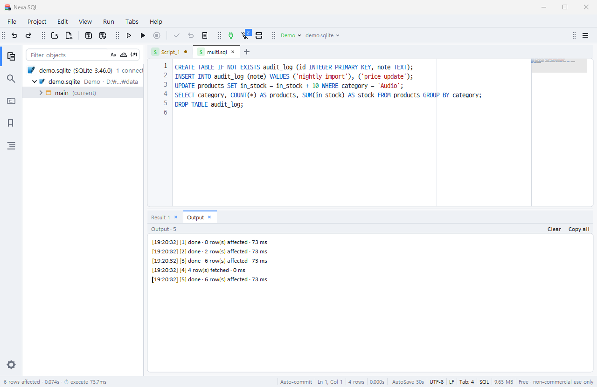

# Output 탭 — 서버 메시지 · PRINT · 컴파일 결과

결과 영역(결과1 · 결과2 … 옆)에 **Output** 탭이 있습니다. 조회 결과가 아닌 "메시지"가 모이는 곳입니다.

- 서버가 보낸 글: Oracle `DBMS_OUTPUT.PUT_LINE` · SQL Server `PRINT`/`RAISERROR` · PostgreSQL `RAISE NOTICE`
- SQL*Plus식 `PRINT 변수` · `EXEC` 결과(`:X = 7`) · `SHOW VARIABLES`
- 프로시저·함수·패키지·트리거·타입을 만들었을 때 **컴파일 결과**: `PROCEDURE BISCM.SP_X compiled · no errors` 또는 `Warning: … created with compilation errors` + 줄/열 목록
- 경고(`⚠`) · 오류(`✖ 3행: …`) · 문장 완료 줄(`[2] 완료 · 0행 영향 · 57 ms` · `[6] 1행 가져옴 · 41 ms`)

줄마다 `[HH:MM:SS]`가 앞에 붙고, 머리 줄의 **지우기** · **전체 복사** 버튼, 드래그 선택 · Ctrl(⌘)+C · 우클릭 복사 · 전체 선택이 됩니다. 오류 줄(`✖ 3행: …`)을 **두 번 클릭**하면 편집기의 그 줄로 갑니다. 다른 탭을 보고 있는 동안 새 메시지가 오면 탭 제목이 `Output (N)`으로 바뀌고, 탭을 보면 돌아옵니다. 조회 결과 없이 메시지만 낸 실행(컴파일 · DDL · PRINT)은 빈 결과 탭을 만들지 않습니다.
편집기 탭마다 Output이 따로 있고, 탭을 닫아도 내용은 남습니다(다시 열면 그대로).

*Output 탭 — 문장별 완료 줄 · 영향 행 수 · 시간*

## 언제 나타나나

| 방법 | 어떻게 |
|---|---|
| 직접 열기/닫기 | **View ▸ Output**(Ctrl+Shift+O · 맥 ⌘⇧O) · 명령 팔레트 "View: Show Output" · 탭의 × |
| 메시지가 오면 자동 | 설정 `output.show` = **auto**(기본 · 첫 메시지가 오면 탭이 생긴다) · `errors`(경고·오류가 올 때만) · `always`(처음부터) · `off`(직접 열 때만) |
| 자동으로 그 탭으로 전환 | `output.activate` = **결과 셋이 없을 때**(기본 · 컴파일 · DDL · PRINT처럼 조회 결과가 없는 실행이면 Output으로 · 오류는 늘) · `always` · `never`(탭은 생기되 뒤에 둠). 전환해도 편집기 포커스는 그대로입니다 |

## 결과 탭과 오가기

Output 탭을 보고 있어도 결과 셋이 있는 문장을 실행하면 **결과 탭으로 돌아옵니다**(설정 `output.activate`를 `always`로 두면 Output이 그대로). Output이 켜진 채 실행해도 결과는 늘 가장 최근 결과 탭에 실립니다.

## 객체 소스 탭에서 F5

객체 탐색기에서 프로시저·함수·패키지(Body)·뷰·트리거·타입을 **소스 열기**로 연 탭은 F5(전체 실행)가 본문을 문장으로 나누지 않고 **한 단위**로 보냅니다
(CREATE OR REPLACE 한 번 = 컴파일 한 번). 결과는 Output에 `▶ PROCEDURE BISCM.SP_X — 소스 전체를 한 단위로 실행(F5)` · 완료 줄 · 컴파일 결과로 옵니다.
그 탭은 객체가 있는 서버의 세션에 붙습니다(다른 서버가 활성이어도). 객체 스키마가 세션의 현재 스키마와 다르면 F5 때 Output에 ⚠ 안내(스키마 한정을 꺼 두었으면 현재 스키마에 만들어진다는 강한 경고)가 나옵니다. DDL 미리보기에서 "편집기에서 열기"로 만든 탭도 같습니다. Ctrl+Enter(현재 문장 · 선택 실행)는 평소와 같아 안의 SELECT만 따로 돌려 결과 그리드를 볼 수 있습니다.

## 관련 설정(Output 카테고리)

| 키 | 기본 | 뜻 |
|---|---|---|
| `output.show` | auto | 탭이 나타나는 때 |
| `output.activate` | no_results | 메시지가 오면 Output 탭으로 전환하는 규칙 |
| `output.done_lines` | on | 문장 완료 줄(끄면 메시지만) |
| `output.timestamps` | on | 줄 앞 시각 |
| `output.max_lines` | 5000 | 편집기 탭마다 보관 줄 수(넘치면 오래된 줄부터) |
| `output.serveroutput` | on | Oracle 새 세션마다 `SET SERVEROUTPUT ON`(끄면 스크립트에서 켤 때만 · 새 접속부터) |
