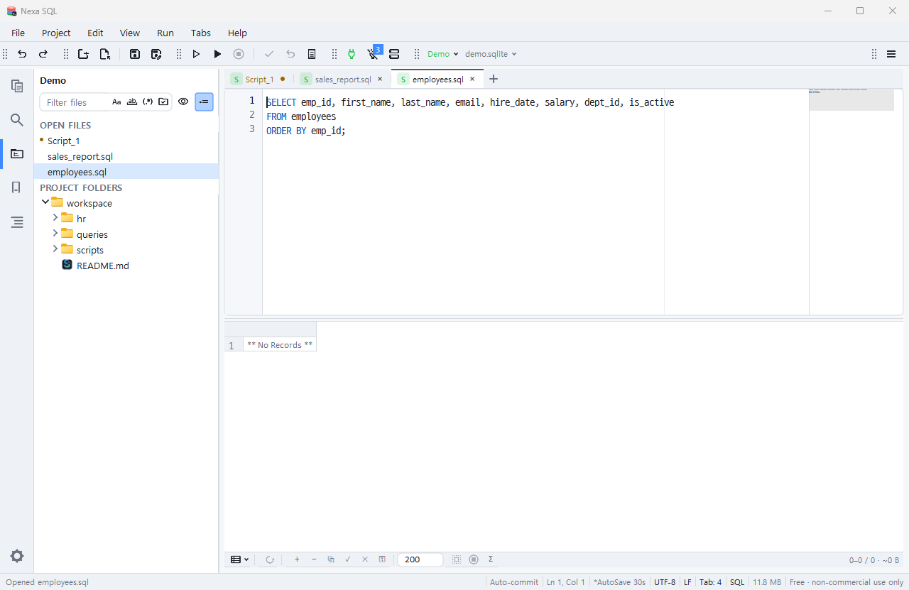
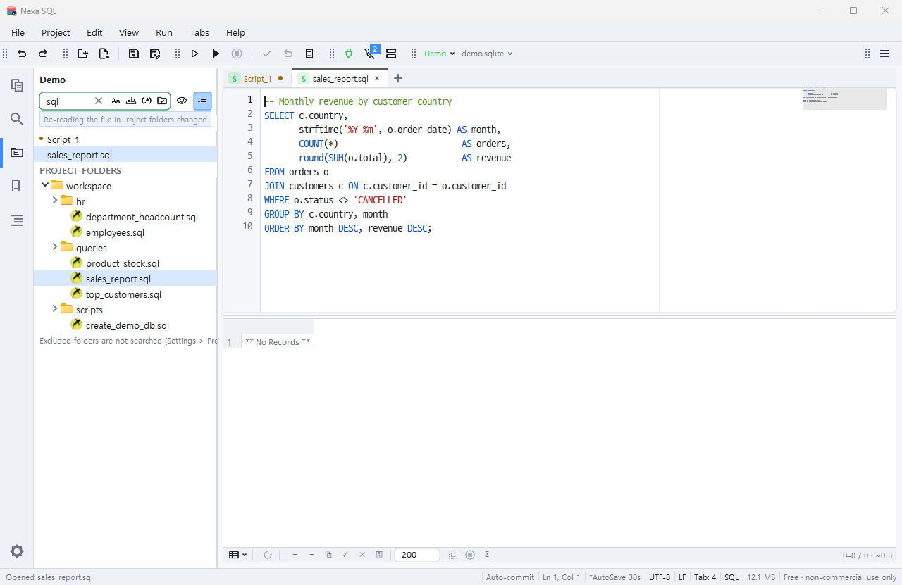

# 프로젝트와 작업 환경

## 작업 모드 셋

| 모드 | 켜는 법 | 상태가 놓이는 곳 |
|---|---|---|
| **파일 모드** | 그냥 실행 | 전역 설정(`%APPDATA%\nexa-sql`) |
| **폴더 모드** | `nexa-sql .` · `nexa-sql <폴더>` | 그 폴더의 **`.nsql/`**(지금은 북마크 · `${workspaceFolder}` = 그 폴더 · 파일 대화상자 시작 폴더 — 설정·다른 기능도 같은 자리에서 나누도록 설계) |
| **프로젝트 모드** | `.nsql-project` 열기/인자 | **프로젝트 파일** 안(아래) |

우선순위는 프로젝트 > 폴더 > 파일이고, 프로젝트를 닫으면 켰던 모드(폴더 또는 파일)로 돌아갑니다.

프로젝트 파일(`<이름>.nsql-project` · JSON · 어디에나 · VCS에 올려도 됨)이 **폴더 목록 + 작업 환경**을 담습니다. 프로젝트를 열면 마지막 작업 상태가 그대로 돌아옵니다.

## 프로젝트 파일에 들어가는 것

| 항목 | 설명 |
|---|---|
| `folders` | 탐색기 루트 폴더(프로젝트 파일 기준 상대 경로) |
| `selected` | 탐색기에서 마지막으로 고른 항목 |
| `tabs` | 편집기 탭 **순서대로** — 파일 탭은 경로만, 이름 없는 스크립트 탭은 **본문**까지(1 MB 이하) · 탭마다 캐럿 위치 + 그 줄의 본문/앞뒤 문맥(외부에서 파일이 바뀌어도 같은 줄을 찾는 **fuzzy 재탐색**) |
| `active` | 활성 탭 |
| `bookmarks` | 북마크 전부(프로젝트가 열려 있으면 북마크는 이 파일에만 저장) |
| `expanded` | 프로젝트 탐색기에서 **펼쳐 둔 폴더**(상대 경로) |
| `panel` | 보이던 좌측 패널(`project` · `bookmarks` · `search` · `ext`) |
| `search` | 파일 검색 패널의 검색어 |
| `bm_collapsed` | 북마크 패널에서 접어 둔 그룹 |
| `profiles` | 마지막에 붙어 있던 접속 프로필 이름 — **표식만**입니다. 다시 열 때 자동으로 접속하지 않고 로그·토스트로 알려 주므로 직접 접속하세요 |

탭 항목의 `preview: true`는 미리보기 탭(북마크·탐색기 한 번 클릭으로 연 것)이었다는 뜻이고 복원도 미리보기로 됩니다.

**저장은 언제나 지금 작업 환경을 담습니다** — Project ▸ 저장 · 새 프로젝트 저장 · 다른 이름으로 · 폴더 추가/제거 · 자동 저장 · 종료(자동 저장이 켜져 있을 때) 전부 같은 길입니다. **열기는 작업 환경을 교체합니다** — 열려 있던 탭 가운데 복원 목록에 없는 것은 닫힙니다(직전 프로젝트가 있었으면 그 파일과 스냅숏에 이미 담긴 상태 · 프로젝트 없이 쓰던 미저장 탭은 남깁니다). 같은 프로젝트를 다시 고르거나 저장할 때는 복원이 돌지 않아 탭이 겹쳐 늘지 않습니다.

프로젝트 파일은 **두 층**입니다: 위쪽은 사람이 읽는 JSON 헤더(폴더 · 탭 메타 · 패널 · 북마크), 그 아래 `%%NSQL-BLOBS%%` 줄부터는 탭마다 `tab=<id> len=<바이트>` 한 줄 + **본문 바이트 그대로**(이스케이프 없음)가 이어집니다. 파일 탭의 **미저장 편집**은 원본에는 쓰지 않고 이 블록에 **탭별로**(1 MB 이하 · 헤더에는 그때의 디스크 해시 `hash`와 `"blob": true`) 담깁니다. 다음에 프로젝트를 열면 그 본문이 **자동으로 올라오고**(미저장 표시 ●) 파일이 그 사이 밖에서 바뀌었으면 로그에 알립니다. 사용자 설정 폴더의 `backups/files/` 스냅숏은 **백업용으로만** 남깁니다(복원에 쓰지 않음 · `project.backup_days` 뒤 정리). 이름 없는 탭에 찍은 북마크도 프로젝트에 같이 저장돼 다시 열면 그 줄에 붙습니다(탭 `id` 재매핑).

## 자동 저장 · 종료

설정 **Project** 분류:

| 키 | 기본 | 뜻 |
|---|---|---|
| `project.autosave` | on | 30초마다(바뀐 것이 있을 때만) + 탭을 열고 닫고 옮긴 뒤 2초 + 종료 때 프로젝트 파일을 저장 |
| `project.autosave_secs` | 30 | 주기(초 · 5~3600) |
| `project.backup_days` | 7 | 미저장 스냅숏 보관 일수 |
| `project.auto_reveal` | off | 탭을 고르면 탐색기가 그 파일까지 펼치고 스크롤(끄면 펼치지 않고 선택 표시만) |
| `project.icons` | on | 탐색기 파일/폴더 아이콘(OS 아이콘 · 향상 모드에서는 꺼짐). 켜면 OS의 셸 아이콘 캐시가 프로세스에 한 번 올라와 약 2 MB를 더 쓰고, 조회 스레드는 조회가 끝난 뒤 5초면 스스로 거둡니다 |

**상태줄의 자동 저장 표시**(`statusbar.autosave`): 설정 값을 보입니다(`자동 저장 30초` / `자동 저장 끔`). 누르면 메뉴가 뜹니다.

| 항목 | 동작 |
|---|---|
| 프로젝트 폴더 열기 | 프로젝트가 열려 있을 때 — OS 탐색기에서 **프로젝트 파일을 선택한 채** 그 폴더를 엽니다 |
| 일반 파일 자동 저장 위치 열기 | 파일 탭의 미저장 스냅숏 폴더 — 지금 탭의 **최신 스냅숏을 선택한 채**(없으면 폴더만) |
| 자동 저장 설정… | 설정 창을 `project.autosave` 자리로 엽니다 |

(Linux는 폴더만 열고 파일 선택은 하지 않습니다 — 데스크톱마다 방식이 달라서.)

**프로젝트 닫기**(Project ▸ 닫기 · 전환 목록의 "프로젝트 없음"): 전체 상태를 프로젝트 파일(+미저장 스냅숏)에 담은 뒤 **처음 실행 상태**로 돌아갑니다 — 빈 `Script_1` 탭 하나만 남고, 좌측은 객체 탐색기만, 북마크 패널은 **로컬 세트**(프로젝트의 북마크는 프로젝트 파일 안에만)를 보입니다. 파일 모드에서 "새 프로젝트 저장"을 하면 그때의 북마크는 프로젝트로 **옮겨지고**(로컬 파일은 비움) 프로젝트를 닫아도 남지 않습니다. 접속은 그대로 둡니다.

종료(창 닫기 X·File ▸ Exit 둘 다 같은 흐름): 자동 저장이면 프로젝트를 저장하고(북마크 파일도 디바운스를 기다리지 않고 바로 씀) 종료 → 아니면 **저장할 것이 있을 때만** "프로젝트 저장 후 종료 / 저장 없이 종료 / 취소"(방금 저장했으면 묻지 않음) → 그 다음 **미저장 파일 탭마다** 저장할지 묻습니다(이름 없는 스크립트 탭은 프로젝트에 본문이 보존되므로 묻지 않음 · 프로젝트가 없으면 전부 묻습니다).

- **열린 파일이 밖에서 바뀌면**(10-07): 탭에 수정이 없으면 다시 읽고, 수정이 있어도 겹치지 않으면 자동 병합합니다. 그때 편집기 오른쪽 아래에 토스트 **"외부 변경 반영"**이 뜹니다(다시 읽음 / 병합 N곳 - Ctrl+Z로 되돌림). 끄려면 설정 ▸ 파일 `file.external_notify`. 꺼도 상태줄과 로그에는 남습니다. 확인 시점 = 창이 활성화될 때 · 탭을 바꿀 때 · 활성 창의 주기 확인(`file.external_poll_ms`).

- **탭 툴팁의 저장 시각**(10-07): 탭 위에 머물면 카드에 `저장: YYYY-MM-DD HH:MM:SS.mmm`이 보입니다 — 파일의 마지막 수정 시각(앱에서 저장했든 밖에서 바꿨든)이고, 저장한 적 없는 탭은 `저장(프로젝트 파일)`로 프로젝트 파일이 마지막으로 저장된 시각을 보여 줍니다(프로젝트가 없으면 `-`). 이 줄은 카드 맨 아래에 있습니다.
- **디스크에서 지워진 파일의 탭**(10-07): 열려 있는 파일이 밖에서 지워지면 편집기 위에 빨간 띠가 뜨고 탭 줄과 점이 진빨강이 됩니다. 탭은 미저장으로 취급되어 닫을 때 묻고, 저장하면 파일을 다시 만듭니다. 미리보기 탭이었다면 일반 탭으로 바뀌어 다른 파일을 눌러도 사라지지 않습니다.
- **파일 색인 갱신 알림**(10-07): 프로젝트 탐색기 위쪽에 잠깐 "파일 색인 다시 읽는 중 - <이유>"(새 파일 저장 · 폴더 감시 넘침 · 주기 갱신 · 폴더 구성 변경 · 첫 읽기) 또는 "폴더 변경 반영: <폴더>"가 보입니다. 폴더 감시(`project.watch`)가 켜져 있으면 주기 재열거(`project.index_ttl_secs`)는 하지 않고 바뀐 폴더만 다시 읽습니다.

## 프로젝트 탐색기(활동 막대 ▸ 프로젝트)

*프로젝트 탐색기 — 열린 파일 · 프로젝트 폴더*

*파일 필터 = Ctrl+P와 같은 파일 색인 · 맞는 파일과 그 위 폴더만*

- **OPEN FILES**(맨 위 · **프로젝트가 없어도** 보임): 열린 탭 순서 · 작은 점 = 미저장 · 활성 탭 강조 · 동시 편집 칸의 탭은 외곽선 · 클릭 = 그 탭 · 머문 행의 × = 닫기.
- **파일 필터 = Ctrl+P와 같은 파일 색인**(10-07): 글자를 치면 폴더를 다시 걷지 않고 색인에서 바로 찾아 **맞는 파일과 그 위 폴더만** 트리에 보입니다(최대 2,000개 · 넘으면 "…외 N개") · 색인을 읽는 동안은 필터 상자에 진행 표시 링 · 제외 폴더(설정 ▸ 프로젝트 ▸ 제외 폴더)는 검색하지 않는다는 안내 · 결과 폴더를 펼치면 그 폴더의 실제 파일이 다시 채워짐 · 글을 지우면 원래 트리.
- **파일 필터**: 틀 안 토글 `Aa`(대소문자) · `ab`(단어) · `(.*)`(정규식) · **경로 포함**(켜면 `폴더/이름` 경로에 일치) · 틀 오른쪽 = 숨김 파일 · 점 파일(Windows) 표시 토글(파일 대화상자와 같은 설정).
- **타입어헤드**: 목록에 포커스가 있을 때 글자를 치면 그 이름으로(OPEN FILES 포함 · 한글 · [탐색기와 필터](Explorers-and-Filters.md#타입어헤드--글자를-치면-그-이름으로)).
- 트리: 셰브론 · OS 아이콘 · 가로 스크롤 · 루트 우클릭 = **Remove Folder from Project** · 빈 곳 클릭 = 선택 해제(마지막 행은 테두리만 남아 ↑/↓의 시작점).
- 편집기 탭 우클릭 ▸ **Reveal in Project Explorer**(프로젝트 폴더 안 파일만 활성).
- 필터가 많이 열거해야 하면 "N개에서 열거를 멈췄습니다"(`project.scan_max` · 새로 열거할 폴더가 남았을 때만 표시).
- **탭과 함께 움직이는 규칙**(10-07): 편집기 탭 클릭 = OPEN FILES의 그 행 선택 + 보이게 스크롤 · 트리는 선택 표시만 · OPEN FILES 행 클릭 = 그 탭 활성 · 트리는 선택 표시만 · 트리의 파일 클릭 = 탭 열림(미리보기) · 포커스는 클릭한 트리 행에 그대로 · 트리로 스크롤하는 것은 "프로젝트 탐색기에서 보기"뿐.
- **탭이 닫힐 때**: 미리보기·확장 탭이 닫히면 지금 자리 유지(`tabs.close_preview_focus` = keep) · 편집기 탭이 닫히면 새로 선택된 탭의 OPEN FILES 행으로(`tabs.close_editor_focus` = move) — [설정 ▸ 탭 동작](Settings.md#탭-동작10-07).

## 명령

Project 메뉴: 새 프로젝트 저장(파일 모드에서도) · 열기 · 전환(최근 목록) · 저장 · 다른 이름으로 · 닫기 · 폴더 추가. CLI에서 프로젝트 안 북마크: `nsql bookmark list --project x.nsql-project`.
