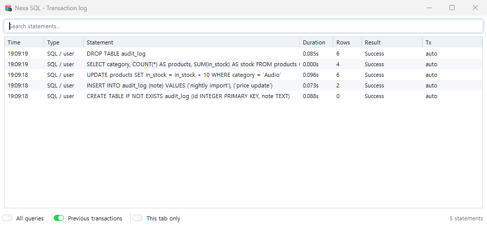

# 트랜잭션 로그

메뉴 **보기 ▸ 트랜잭션 로그**(또는 툴바의 로그 버튼)로 엽니다. 실행한 문장이 한 줄씩 쌓이고, 각 줄에 소요 시간 · 행 수 · 결과 · **트랜잭션 결과**(커밋됨 · 롤백됨 · 대기 · 자동)가 붙습니다. 롤백된 문장은 흐리게 취소선으로 보입니다.

*트랜잭션 로그 창 — 문장 · 걸린 시간 · 행 수 · 결과 · 트랜잭션*

## 바인드 변수까지 — 세 층으로 보기

그리드 편집이나 `:이름` 바인드를 쓴 문장은 표의 "문장" 열만으로는 어떤 행에 닿았는지 알기 어렵습니다. **행을 클릭**하면 표 아래에 상세가 열립니다.

| 층 | 무엇 |
|---|---|
| ① 보낸 문장 | 서버에 보낸 그대로(바인드 형태 · `WHERE "ID" = :P2`) |
| ② 바인드 변수 | 이름 · 타입 · 값 표(OUT 변수는 `(OUT)` 표시) |
| ③ 값을 치환한 문장 | ①의 `:이름` 자리에 ②의 값을 넣은 문장(`WHERE "ID" = 'A001'`) |

③은 **읽기용으로 앱이 만든 문장**입니다. 서버는 ①의 바인드 형태를 받았습니다. 문자열·주석·인용 식별자 안의 `:이름`과 PostgreSQL `::` 캐스트는 바꾸지 않고, OUT 변수와 목록에 없는 이름은 `:이름` 그대로 둡니다.

- 같은 행을 다시 클릭하거나 빈 곳을 클릭하면 상세가 닫힙니다.
- 상세 위에서 휠 = 상세만 스크롤.
- 행 우클릭: **문장 복사** · **새 편집기 탭으로** · **값 적용 문장 복사** · **값 적용 문장을 새 탭으로**.

바인드가 없는 문장은 ②가 "(바인드 변수 없음)"이고 ③은 ①과 같습니다.

## 거르기

- 검색 상자 = 문장 부분 일치.
- **모든 질의**(끔 = 사용자 문장만 · 켬 = 탐색기·보조 질의까지) · **이전 트랜잭션**(닫힌 트랜잭션도) · **이 탭만**.
- 세션이 둘 이상이면 오른쪽 끝에 "세션" 열이 생깁니다.
