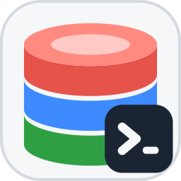

# Nexa SQL 브랜딩 자산

앱 아이콘의 **SSOT**. 사용자 선택(09-14) = 시안 **B "Union"**: 색이 다른 디스크 세 장(서로 다른 DBMS)이
**한 실린더로 융합**되고, 뒤(위)쪽 디스크가 더 커서 원근이 생긴다 · 우하단 `>_` 배지 = 클라이언트·CLI.
"모든 DB를 하나로 통합 지원한다"를 한 장으로 말한다. 다른 시안(A Converge · C Hub)은 `drafts/`에 남겨 둔다.

## 계열 안에서의 자리

| 앱 | 모티프 | 바탕 |
| --- | --- | --- |
| nexa-dir2 | 폴더 + `>_` | 다크 네이비 |
| nexa-beep | 말풍선 + 비콘 | 파랑 |
| nexa-clip | 클립보드 + 히스토리 스택 | 청록 |
| ★ **nexa-sql** | **융합 실린더(빨강·파랑·초록) + `>_`** | **밝은 회백 `#F6F7F9`**(다크 작업표시줄에서 잘 띈다) |

색은 앱 테마 팔레트 그대로: danger `#E5534B` · accent `#3D8BFF` · ok `#2EA043` · 잉크 `#1B2432`.

## 파일

| 파일 | 용도 |
| --- | --- |
| `icon.svg` | **원본 SSOT** — 아이콘 변경은 여기부터 |
| `nexa-sql-1024.png` · `nexa-sql-256.png` | 스토어·문서·macOS 원본 |
| `png/nexa-sql-{16…1024}.png` | Linux hicolor 세트 · 일반 배포 |
| `nexa-sql.ico` | Windows(16·24·32·48·256 · PNG 프레임) — NSIS/실행 파일 리소스 |
| `nexa-sql.icns` | macOS `.app` 번들 |
| `nexa-sql-32.rgba` · `nexa-sql-64.rgba` | **런타임 창 아이콘**(`crates/nexa-sql/src/icon.rs` `include_bytes!` · 디코더 없음) |
| `drafts/*.svg` | 시안 A·B·C |

## 재생성 (SVG → PNG/ICO/ICNS/RGBA)

외부 도구 없이 이 기기에서는 **헤드리스 Edge**로 1024px PNG를 뜨고 Python(PIL)으로 나머지를 만든다:

```bash
# 1) SVG → 1024 PNG (투명 배경)
msedge --headless=new --disable-gpu --hide-scrollbars --default-background-color=00000000 \
  --window-size=1024,1024 --screenshot=icon-1024.png render.html   # render.html = 
# 2) PNG 세트 · .ico(PNG 프레임) · .icns(PNG 페이로드) · .rgba
python scripts/pack_icon.py icon-1024.png packaging/branding
```

`rsvg-convert`/ImageMagick이 있으면 1)을 `rsvg-convert -w 1024 -h 1024 icon.svg > icon-1024.png`로 대체.
